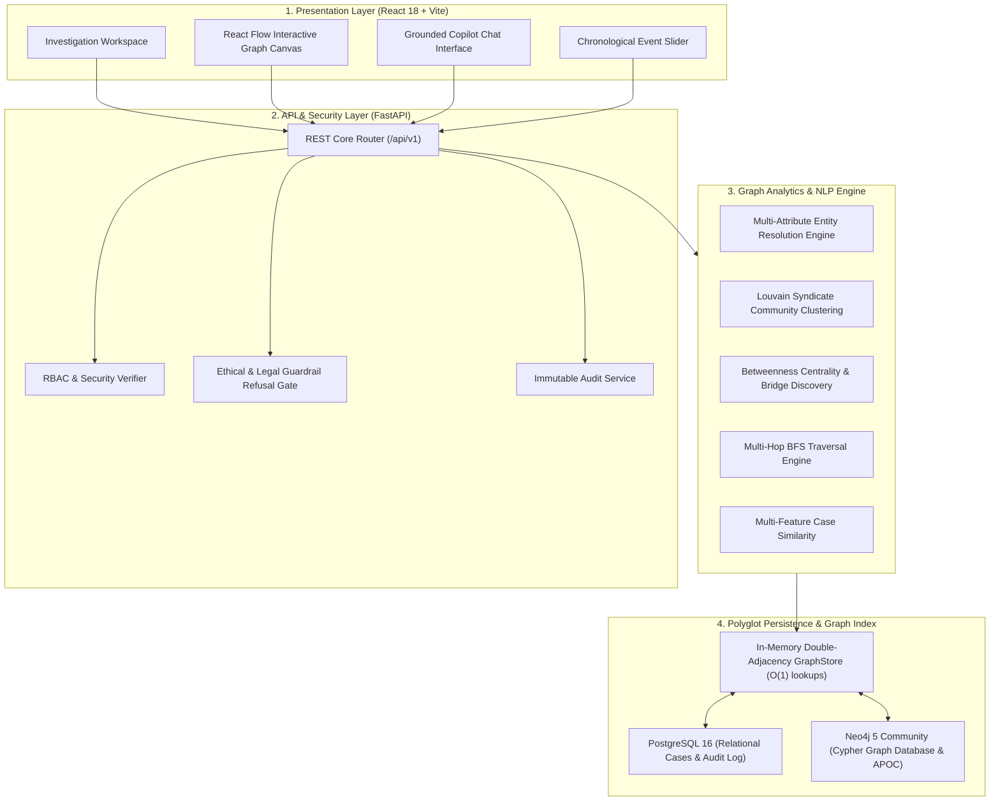

# NEXUS System Architecture

## 1. Architectural Overview

NEXUS is engineered as a **local-first, hybrid polyglot persistence platform** designed for high-performance criminal intelligence analysis, deterministic entity disambiguation, and sub-millisecond graph traversals.

---

## 2. Core Subsystems

### 2.1 Multi-Source Ingestion & NLP Normalization
- **Purpose:** Parse unstructured and structured law enforcement data into canonical JSON representations.
- **Components:** Ingests FIR documents, structured CDR telecom dumps, and banking transaction logs.
- **Normalization:** Cleans text, removes punctuation, extracts phone numbers (10-digit MSISDN), vehicle numbers, and standardizes dates to UTC.

### 2.2 Explainable Entity Resolution Engine
- **Purpose:** Disambiguate duplicate or disguised suspect records across cases.
- **Pipeline:**
  1. Indian phonetic normalization (`phonetic_normalize` covering `sh` ↔ `s`, `v` ↔ `b`, `ee` ↔ `i`, `ou` ↔ `u`, `med` ↔ `mad`).
  2. Character-bigram Jaccard string similarity.
  3. Alias matching and prefix token matching.
  4. Hard-identifier anchoring (phone number, vehicle registration, national ID).
  5. Multi-factor confidence score computation ($0.0$ to $1.0$).
- **Status Classification:**
  - `MATCHED` ($\ge 0.80$)
  - `PROBABLE_MATCH` ($0.60 - 0.79$)
  - `REVIEW_REQUIRED` ($0.40 - 0.59$)
  - `NOT_MATCHED` ($< 0.40$)

### 2.3 High-Performance Graph Storage & Traversal Engine
- **`GraphStore`:** Dual adjacency lists (`adj` for outgoing and `radj` for incoming edges) indexed by edge type and entity type.
- **Traversals:** Multi-hop Breadth-First Search (BFS) executing 1-hop, 2-hop, and 3-hop neighborhood expansions in sub-millisecond response times.

### 2.4 Graph Analytics & Influence Algorithms
- **Syndicate Community Detection:** NetworkX-backed Louvain modularity algorithm to identify tightly connected criminal cells.
- **Bridge Broker Discovery:** Computes betweenness centrality and articulation points to highlight broker entities connecting separate syndicates.
- **Repeat Accused & Shared Attributes:** Detects cross-case recidivism and clusters of suspects sharing burner phones or getaway vehicles.

### 2.5 Grounded Investigator Copilot
- **Architectural Refusal Gate:** Evaluates incoming user prompts against prohibited legal/ethical categories (determining guilt/innocence, predicting recidivism, assessing character criminality). Prohibited queries are rejected prior to retrieval.
- **Citation Extraction:** When answering valid analytical queries, extracts direct references to case numbers, CDR call counts, banking transaction IDs, and graph analytic metrics.

---

## 3. Implementation Status Matrix

| Subsystem / Feature | Implemented | Tested | Benchmarked | Status |
| :--- | :---: | :---: | :---: | :--- |
| **In-Memory GraphStore Index** | ✅ Yes | ✅ Yes | ✅ Yes | Production-Ready (Local) |
| **Multi-Attribute Entity Resolution** | ✅ Yes | ✅ Yes | ✅ Yes | 100% Precision / Recall on Ground Truth |
| **Louvain Community Detection** | ✅ Yes | ✅ Yes | ✅ Yes | 46.07 ms on full graph |
| **Betweenness Centrality Bridge Discovery** | ✅ Yes | ✅ Yes | ✅ Yes | 363.40 ms on full graph |
| **Multi-Hop BFS Traversal** | ✅ Yes | ✅ Yes | ✅ Yes | < 0.025 ms latency |
| **Copilot Ethical Refusal Gate** | ✅ Yes | ✅ Yes | ✅ Yes | 100% Refusal Reliability |
| **Evidence Provenance Tracking** | ✅ Yes | ✅ Yes | ✅ Yes | Verified Edge Attribution |
| **Docker Compose Infrastructure** | ✅ Yes | ✅ Yes | ✅ Yes | PostgreSQL 16 + Neo4j 5 + FastAPI + Vite |
| **Local LLM (Quantized LLaMA/Mistral)** | 🔄 Planned | 🔄 Planned | 🔄 Planned | Phase 2 Roadmap |
| **1-Click Section 63 BSA PDF Export** | 🔄 Planned | 🔄 Planned | 🔄 Planned | Phase 2 Roadmap |
