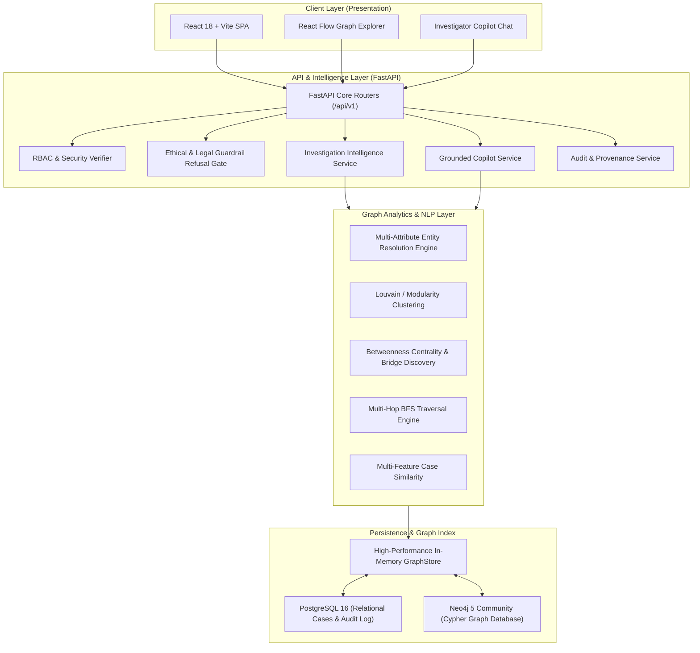

# NEXUS System Architecture

## 1. Architectural Overview

NEXUS is engineered with a **local-first, hybrid polyglot persistence architecture** designed for high-throughput criminal intelligence analysis, deterministic entity resolution, and sub-millisecond graph query response times.

---

## 2. Component Subsystems

### 2.1 Graph Analytics & Adjacency Index
- **`GraphStore`:** In-memory double-adjacency list (`adj` and `radj`) indexed by edge type and entity type. Enables immediate O(degree) forward and backward traversals without database round-trips.
- **`NetworkX Integration`:** Constructs undirected and directed views on-demand to compute community partitions (modularity score) and betweenness centrality to identify broker nodes (articulation points).

### 2.2 Explainable Entity Resolution Engine
1. **Normalization Pipeline:** Lowercase, punctuation removal, Indian phonetic mapping (`sh` ↔ `s`, `v` ↔ `b`, `ee` ↔ `i`, `ou` ↔ `u`, `med` ↔ `mad`).
2. **Multi-Attribute Corroboration:**
   - National ID / Passport: Definitive (+1.00)
   - Verified Phone Number: High Confidence (+1.00)
   - Vehicle Registration: Strong Link (+0.85)
   - Exact/Phonetic Name: Strong Link (+1.00)
   - Known Alias Overlap: Medium Link (+1.00)
   - Address / Hideout Jaccard Similarity: Corroboration (+0.30)
3. **Status Classification:**
   - `MATCHED` (Confidence $\ge 0.80$)
   - `PROBABLE_MATCH` ($0.60 \le \text{Confidence} < 0.80$)
   - `REVIEW_REQUIRED` ($0.40 \le \text{Confidence} < 0.60$)
   - `NOT_MATCHED` ($\text{Confidence} < 0.40$)

### 2.3 Copilot Refusal Gate & Provenance Citations
- **Refusal Gate:** Evaluates incoming user prompts against prohibited legal/ethical categories (determining guilt/innocence, predicting recidivism, assessing character criminality). Prohibited queries are rejected prior to retrieval.
- **Citation Extraction:** When answering valid analytical queries, extracts direct references to case numbers, CDR call counts, banking transaction IDs, and graph analytic metrics.

### 2.4 Role-Based Access Control (RBAC)
- Supported Roles: `INVESTIGATOR`, `ANALYST`, `SUPERVISOR`, `ADMIN`.
- Supervisors and Administrators possess oversight privileges, including audit trail querying and cross-district rollup visibility.
