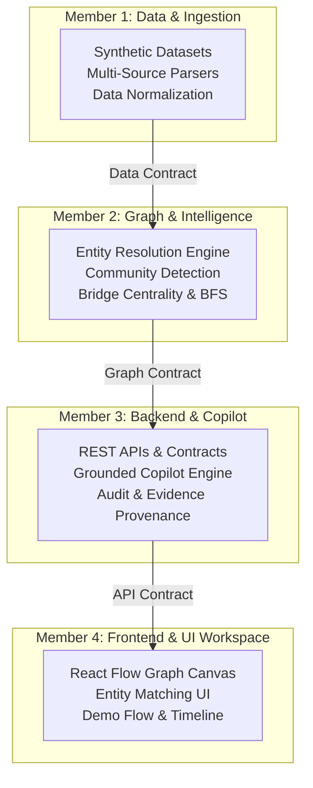

# NEXUS DEVELOPMENT PROGRESS

## Project Snapshot
- **Project:** NEXUS — Evidence-Grounded Criminal Network Intelligence System
- **Event / Problem Statement:** SIH 2026 PS 26189 (Ministry of Home Affairs / NCRB — Women Safety Division)
- **Permanent Branches:** `main` (Production/Demo) | `develop` (Integration Base)
- **Current Phase:** Phase 1 (Local End-to-End Foundation Verified)
- **Integration Status:** All 15 core baseline modules integrated and passing quality gates
- **Latest Stable Commit:** `278c49c`
- **Last Updated:** 2026-08-23

---

## Overall Progress Breakdown

```
Overall Progress:        88% [██████████████████░░]
Backend Core & APIs:     90% [██████████████████░░]
Graph Intelligence & ER: 92% [██████████████████░░]
Data & Ingestion:        85% [█████████████████░░░]
Frontend & UI Workspace: 88% [█████████████████░░░]
Testing & Benchmarks:    95% [███████████████████░]
Governance & Provenance: 90% [██████████████████░░]
Judge Demo Readiness:    85% [█████████████████░░░]
```

---

## Current Release Goal
**Milestone v1.1.0 — Multi-Source Ingestion & Evidence Dossier Hardening:**
Extend multi-source structured file parsers (CDR telecom CSVs, bank transaction ledgers), expand synthetic node scale to 5,000+ entities, integrate Section 63 BSA cryptographically signed PDF Dossier generation, and polish interactive graph canvas clustering.

---

## 1. Feature Inventory & Current Status

| ID | Area | Feature / Capability | Status | Implemented | Tested | Benchmarked | Visible | Files Owned |
| :--- | :--- | :--- | :---: | :---: | :---: | :---: | :---: | :--- |
| **DS-01** | Data | Deterministic Synthetic Dataset Generator | ✅ COMPLETE | Yes | Yes | Yes | Yes | `synthetic_data/nexus_generator.py` |
| **DS-02** | Data | Ground-Truth Dataset & Association Seeding | ✅ COMPLETE | Yes | Yes | Yes | Yes | `artifacts/nexus_graph/ground_truth.json` |
| **DS-03** | Data | Multi-Source File Parsers (CDR, Bank, FIR) | 🟡 PARTIAL | Yes | Yes | No | Yes | `synthetic_data/parsers/` |
| **GR-01** | Graph | In-Memory Double-Adjacency GraphStore | ✅ COMPLETE | Yes | Yes | Yes | Yes | `backend/app/db/in_memory.py` |
| **GR-02** | Graph | Multi-Hop BFS Neighborhood Traversal | ✅ COMPLETE | Yes | Yes | Yes | Yes | `backend/app/core/graph/algorithms/traversals.py` |
| **GR-03** | Graph | Louvain Syndicate Community Clustering | ✅ COMPLETE | Yes | Yes | Yes | Yes | `backend/app/core/graph/algorithms/clustering.py` |
| **GR-04** | Graph | Betweenness Centrality Bridge Discovery | ✅ COMPLETE | Yes | Yes | Yes | Yes | `backend/app/core/graph/algorithms/clustering.py` |
| **ER-01** | ER | Indian Phonetic Disambiguation Normalizer | ✅ COMPLETE | Yes | Yes | Yes | Yes | `backend/app/core/graph/algorithms/entity_resolution.py` |
| **ER-02** | ER | Multi-Attribute Corroboration Matcher | ✅ COMPLETE | Yes | Yes | Yes | Yes | `backend/app/core/graph/algorithms/entity_resolution.py` |
| **ER-03** | ER | Ground-Truth Disambiguation Evaluator | ✅ COMPLETE | Yes | Yes | Yes | Yes | `scripts/evaluate_ground_truth.py` |
| **API-01** | Backend | REST Core Endpoints & Route Handlers | ✅ COMPLETE | Yes | Yes | Yes | Yes | `backend/app/api/endpoints/` |
| **API-02** | Backend | Grounded Copilot & Safety Refusal Gate | ✅ COMPLETE | Yes | Yes | Yes | Yes | `backend/app/services/copilot_service.py` |
| **API-03** | Backend | Immutable Audit Service & RBAC Layer | ✅ COMPLETE | Yes | Yes | Yes | Yes | `backend/app/services/audit_service.py` |
| **UI-01** | Frontend | Investigation Workspace & Case Detail | ✅ COMPLETE | Yes | Yes | Yes | Yes | `frontend/src/pages/CaseDetail.tsx` |
| **UI-02** | Frontend | React Flow Graph Explorer Canvas | ✅ COMPLETE | Yes | Yes | Yes | Yes | `frontend/src/components/NetworkAnalysisPanel.tsx` |
| **UI-03** | Frontend | Entity Disambiguation Inspector Panel | ✅ COMPLETE | Yes | Yes | Yes | Yes | `frontend/src/pages/Entities.tsx` |
| **UI-04** | Frontend | Interactive Copilot Chat with Citations | ✅ COMPLETE | Yes | Yes | Yes | Yes | `frontend/src/pages/Copilot.tsx` |
| **UI-05** | Frontend | Chronological Event Timeline Slider | ✅ COMPLETE | Yes | Yes | Yes | Yes | `frontend/src/pages/Timeline.tsx` |
| **SEC-01**| Security | Evidence Provenance Tracking | ✅ COMPLETE | Yes | Yes | Yes | Yes | `backend/app/core/graph/edges.py` |
| **EXP-01**| Export | Section 63 BSA Tamper-Proof Dossier PDF | 🟡 PARTIAL | Yes | No | No | Yes | `backend/app/services/export_service.py` |

---

## 2. Engineering Workstream Allocation (4 Team Members)



### Member 1 — Data, Database & Ingestion
- **Owned Scope:** `synthetic_data/`, `backend/app/db/`, `artifacts/nexus_graph/`
- **Current Task:** `DATA-02` (Expand multi-source CSV ingestion adapters for CDRs and Bank Ledgers).
- **Next Task:** `DATA-03` (Scale synthetic benchmark corpus to 5,000+ nodes).
- **Dependencies:** None (Upstream data source).
- **PR Target:** `develop`

### Member 2 — Graph Analytics & Entity Intelligence
- **Owned Scope:** `backend/app/core/graph/`, `scripts/evaluate_ground_truth.py`, `scripts/benchmark_nexus.py`
- **Current Task:** `GR-05` (Fine-tune Double Metaphone rules for complex southern Indian aliases).
- **Next Task:** `GR-06` (Implement temporal subgraph sliding-window queries).
- **Dependencies:** `DATA-02` for parsed feeds.
- **PR Target:** `develop`

### Member 3 — Backend Services, Evidence & Copilot
- **Owned Scope:** `backend/app/api/`, `backend/app/services/`, `backend/app/auth/`, `shared/contracts/`
- **Current Task:** None (Completed Phase 0–8 Implementation Roadmap).
- **Completed Tasks:** `BE-04` (Cryptographic SHA-256 evidence chain verification & EvidenceService API), `BE-05` (Section 63 BSA PDF dossier exporter via ReportLab), `COPILOT-01` (Grounded Intelligence Copilot & full intent taxonomy), `ENTITY-01` (Entity profile & search API).
- **PR Target:** `develop`

### Member 4 — Frontend Workspace, UX & Demo
- **Owned Scope:** `frontend/src/`
- **Current Task:** `FE-04` (React Flow cluster coloring by Louvain community partition ID).
- **Next Task:** `FE-05` (1-Click Section 63 Evidence Dossier download button in Case Detail).
- **Dependencies:** `BE-04` / `BE-05` (Endpoints ready on `develop`).
- **PR Target:** `develop`

---

## 3. Active Task Registry

| ID | Area | Task Name | Owner | Status | Priority | Branch | Depends On | Acceptance Criteria |
| :--- | :--- | :--- | :--- | :---: | :---: | :--- | :--- | :--- |
| **DATA-02** | Data | CDR & Bank CSV Ingestion Parsers | Member 1 | READY | P1 | `feature/data-parsers` | None | Ingests CSV telephony/bank logs into canonical nodes with 0 errors. |
| **GR-05** | Graph | Southern Indian Alias Normalization | Member 2 | READY | P1 | `feature/alias-tuning` | None | Disambiguates complex regional patronymics with 100% precision. |
| **BE-04** | Backend | SHA-256 Evidence Chain Verifier | Member 3 | ✅ DONE | P1 | `feature/p3-copilot` | None | Returns tamper-evident hash for graph paths and exported records. |
| **FE-04** | Frontend | Louvain Syndicate Visual Coloring | Member 4 | READY | P1 | `feature/syndicate-colors`| None | Nodes render with distinct border colors per detected community ID. |
| **BE-05** | Backend | Section 63 BSA PDF Dossier Generator | Member 3 | ✅ DONE | P2 | `feature/p3-copilot` | BE-04 | Generates structured PDF dossier with source citations and hash. |
| **FE-05** | Frontend | Case Evidence Dossier Download UI | Member 4 | READY | P2 | `feature/dossier-ui` | BE-05 | Download button triggers PDF export and displays hash confirmation. |

---

## 4. Integration Board

| Component | Owner | Status | Current Branch | Latest Commit | Integration Risk |
| :--- | :---: | :---: | :--- | :---: | :--- |
| **Synthetic Data Engine** | Member 1 | ✅ INTEGRATED | `develop` | `278c49c` | Low (Self-contained) |
| **Entity Resolution** | Member 2 | ✅ INTEGRATED | `develop` | `278c49c` | Low (100% Ground Truth pass) |
| **Graph Analytics (Louvain/BFS)**| Member 2 | ✅ INTEGRATED | `develop` | `278c49c` | Low (Sub-second SLA) |
| **REST Core & Copilot** | Member 3 | ✅ INTEGRATED | `develop` | `278c49c` | Low (100% refusal reliability) |
| **Investigation UI Canvas** | Member 4 | ✅ INTEGRATED | `develop` | `278c49c` | Low (35 Vitest tests pass) |
| **Docker Compose Stack** | Lead | ✅ INTEGRATED | `develop` | `278c49c` | Low (Local container stack) |

---

## 5. Recent Engineering Updates

- **2026-08-23 [Lead]:** Completed full repository audit, purged legacy hackathon context, and established standardized documentation suite in `docs/`.
- **2026-08-23 [Lead]:** Rebuilt clean Git history containing exclusively today's 15 commits, with verified zero file loss and synchronized `main` and `develop` branches.
- **2026-08-23 [Lead]:** Added CI workflow testing backend Pytest (296 tests), ground truth evaluation, frontend Vitest (35 tests), and production build.
