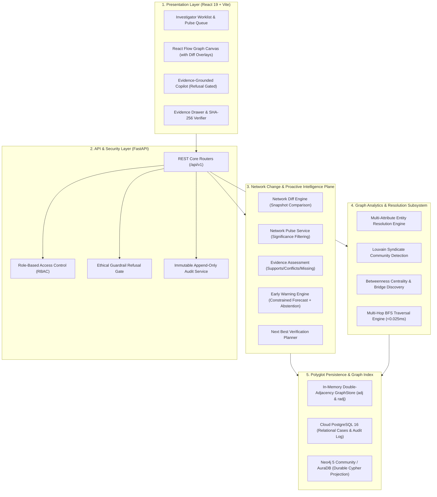

# NEXUS — Evidence-Grounded Criminal Network Change Intelligence Platform

> **Smart India Hackathon (SIH) 2026** — Problem Statement ID: 26189  
> **Client Organization:** Ministry of Home Affairs (MHA) / National Crime Records Bureau (NCRB)  
> **Division:** Women Safety Division | **Theme:** Blockchain & Cybersecurity  

[](docs/DEVELOPMENT.md)
[](docs/DEVELOPMENT.md)
[](docs/BENCHMARKS.md)
[](docs/BENCHMARKS.md)
[](docs/DEVELOPMENT.md)
[](docker-compose.yml)

---

## 1. What is NEXUS?

**NEXUS** transforms criminal network analysis from static, retrospective link charts into **proactive, evidence-grounded criminal network change intelligence**.

Operating on the continuous investigative loop:
$$\text{observe} \to \text{connect} \to \text{detect change} \to \text{forecast only what is justified} \to \text{alert} \to \text{verify} \to \text{act} \to \text{learn}$$

NEXUS bridges disconnected First Information Reports (FIRs), Call Detail Records (CDRs), and banking transactions into an explainable, multi-relational knowledge graphs. It detects how an observed network adapts over time, grounds every insight in verifiable source evidence, identifies evidence gaps, suggests next-best verification actions, and securely propagates actionable intelligence across police station jurisdictions.

---

## 2. Core Value Proposition & Headline Differentiators

Traditional law enforcement software displays static connections after crimes occur. NEXUS introduces three transformative capabilities:

1. **Early-Warning Network Intelligence:** Detects meaningful structural adaptations (bridge emergence, intermediary substitution, community splits, identifier shifts) and produces evidence-supported forecasts of narrowly defined operational next states—with mandatory abstention whenever evidence is sparse, stale, or conflicting.
2. **Digital Shadow & Identity Drift Radar:** Correlates public and authorized digital signals with offline case telemetry to detect when syndicate kingpins discard burner devices, rotate mule bank accounts, or adopt phonetic aliases.
3. **Trusted Cross-Branch Intelligence Exchange:** Binds every link to an immutable Section 63 Bharatiya Sakshya Adhiniyam (BSA) evidence provenance record with SHA-256 cryptographic verification, allowing verified intelligence to be safely routed to affected investigations across state lines.

---

## 3. Strict Legal & Ethical Guardrails

- ❌ **Zero Predictive Guilt Scoring:** NEXUS does NOT predict individual criminality, recidivism risk, or guilt probability. Determination of criminal guilt is the exclusive constitutional prerogative of the judiciary under Indian law.
- 🔒 **Deterministic Before Generative:** All graph traversals, entity resolution, community clustering, and snapshot diffing run via deterministic mathematical algorithms. Generative AI is restricted to summarization and is gated by an architectural refusal interceptor.
- 🛡️ **Zero Real Citizen PII:** All development, testing, CI benchmarks, and demonstrations operate strictly on high-fidelity synthetic datasets.
- ⚖️ **Abstention as an Output:** If evidence is insufficient or contradictory, the system explicitly outputs `INSUFFICIENT EVIDENCE / NO FORECAST`.
- 🚫 **No Raw Data on Public Blockchains:** Sensitive case records and citizen PII never touch public ledgers. Trust mechanisms rely on cryptographic hashing and Merkle proofs.

---

## 4. System Architecture Overview

NEXUS employs a hybrid polyglot persistence architecture engineered for sub-millisecond graph query SLAs and durable persistence:



---

## 5. Repository Structure & Single Source of Truth

```
/
├── README.md               # Executive overview, value proposition, quick-start
├── AGENTS.md               # AI coding governance & development rules
├── progress.md             # Single source of truth for ongoing progress
├── decisions.md            # Single source of truth for architectural ADRs (DEC-001 - DEC-012)
├── docs/                   # Canonical documentation set (strictly authoritative)
│   ├── ARCHITECTURE.md     # Polyglot persistence, change plane, subsystems (Layers 1-9)
│   ├── DATA_MODEL.md       # 12 graph entities, typed edges, and target domain objects
│   ├── API.md              # Core REST endpoints & request/response contracts
│   ├── INTELLIGENCE_PIPELINE.md # 11-stage proactive intelligence processing lifecycle
│   ├── SECURITY.md         # Responsible AI, Section 63 BSA, SHA-256 integrity, RBAC
│   ├── BENCHMARKS.md       # Measured SLA latency and scale evaluation protocols
│   ├── DEMO.md             # 3-minute live demonstration journey for evaluators
│   ├── DEPLOYMENT.md       # Production hosting on Render & Vercel
│   ├── DEVELOPMENT.md      # Setup, test commands, lint, benchmark verification, seeding
│   ├── archive/            # Historical documents & milestone reports (reference only)
│   └── NEXUS_ROADMAP_CONTEXT/ # Target product reference pack (non-authoritative)
├── backend/                # FastAPI application, core graph, db, services
├── frontend/               # React 19, TypeScript, Tailwind, React Flow
├── shared/                 # Canonical schemas & contracts
├── synthetic_data/         # Deterministic synthetic intelligence generator
├── scripts/                # Benchmarking, evaluation, and seeding scripts
└── tests/                  # Pytest backend & scale test suites
```

---

## 6. Local Quick-Start

### Using Docker Compose:
```bash
docker compose up --build
```
- Frontend UI: `http://localhost:5173`
- Backend Swagger API: `http://localhost:8000/docs`
- Neo4j Browser: `http://localhost:7474` (User: `neo4j`, Password: `nexuspassword`)

### Using Local Virtual Environment:
```bash
# 1. Backend
python -m venv venv
.\venv\Scripts\Activate.ps1   # or source venv/bin/activate
pip install -r backend/requirements.txt
uvicorn backend.app.main:app --reload --port 8000

# 2. Frontend (in separate terminal)
cd frontend
npm install
npm run dev
```

---

## 7. Testing & Quality Verification Gates

```bash
# Backend unit & integration tests (708 passing)
pytest

# Backend linting (0 errors required)
python -m ruff check backend/ shared/ tests/

# Frontend tests & production build (114 passing, 0 TypeScript errors)
cd frontend && npm test -- --run && npm run build

# Ground-truth entity resolution benchmark (100% Precision / Recall)
python scripts/evaluate_ground_truth.py
```

---

## 8. Authoritative Documentation Navigation

- **[Progress & Status Board](progress.md)** — Active workstreams, completed milestones, verification matrix.
- **[Architectural Decisions](decisions.md)** — Record of accepted ADRs (DEC-001 through DEC-012).
- **[System Architecture](docs/ARCHITECTURE.md)** — Detailed subsystem architecture and data flows.
- **[Data Model & Ontology](docs/DATA_MODEL.md)** — 12 core graph entities, typed edges, and target domain models.
- **[API Reference](docs/API.md)** — REST API contracts, request payloads, and response structures.
- **[Intelligence Pipeline](docs/INTELLIGENCE_PIPELINE.md)** — 11-stage intelligence processing lifecycle.
- **[Security & Governance](docs/SECURITY.md)** — Ethical AI firewall, Section 63 BSA compliance, and RBAC.
- **[Performance Benchmarks](docs/BENCHMARKS.md)** — SLA measurements and scale evaluation protocols.
- **[Live Demo Script](docs/DEMO.md)** — 3-minute end-to-end judge demonstration walkthrough.
- **[Deployment Guide](docs/DEPLOYMENT.md)** — Production deployment on Render and Vercel.
- **[Developer Guide](docs/DEVELOPMENT.md)** — Environment setup, tests, and dataset seeding.
