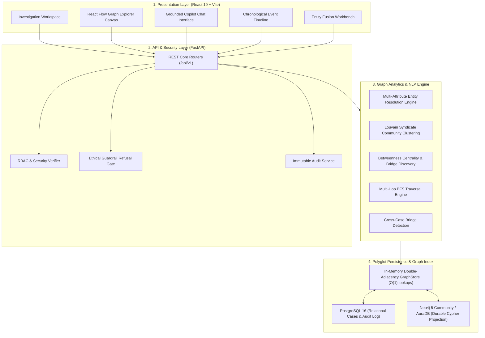

# NEXUS System Architecture

NEXUS is engineered as a **local-first, hybrid polyglot persistence platform** for criminal intelligence analysis, deterministic entity disambiguation, and sub-millisecond graph traversals.

---

## 1. Architectural Overview

---

## 2. Polyglot Persistence Model

NEXUS maintains a strict separation of database responsibilities:

1. **In-Memory `GraphStore` (High-Speed Local Engine):**
   - Dual adjacency lists (`adj` and `radj`) indexed by edge type and entity type in Python memory.
   - Executes 1-hop, 2-hop, and 3-hop BFS expansions in sub-millisecond time (<0.025ms).
   - Powers interactive UI canvas manipulations and pathfinding without network latency.

2. **Neo4j 5 Community / AuraDB (Durable Graph Projection):**
   - Authoritative graph database for durable Cypher queries, graph pattern matching, and multi-analyst persistence.
   - Idempotent schema constraints on `NexusNode(id)`.
   - Batch parameterized synchronization via Cypher `UNWIND ... MERGE`.
   - Bidirectional projection (`read_projection` $\rightarrow$ `GraphStore`).
   - Graceful non-fatal fallback when offline.

3. **PostgreSQL 16 (Relational Application State):**
   - Case registries, investigator identities, RBAC roles, and immutable append-only audit logs.

---

## 3. Core Analytical Subsystems

### 3.1 Explainable Entity Resolution Engine
- **Indian Phonetic Normalizer:** Rule-based normalizer handling regional spelling variations (`sh` ↔ `s`, `v` ↔ `b`, `ee` ↔ `i`, `ou` ↔ `u`, `med` ↔ `mad`).
- **Multi-Attribute Corroboration:** Combines character-bigram Jaccard similarity, alias tracking, and hard identifiers (phone numbers, IMEIs, vehicle plates, national IDs).
- **Match Confidence Bands:**
  - `MATCHED` ($\ge 0.80$)
  - `PROBABLE_MATCH` ($0.60 - 0.79$)
  - `REVIEW_REQUIRED` ($0.40 - 0.59$)
  - `NOT_MATCHED` ($< 0.40$)

### 3.2 Graph Centrality & Community Discovery
- **Louvain Modularity:** Deterministic clustering isolating tightly connected criminal syndicates.
- **Betweenness Centrality:** Brandes algorithm isolating kingpin brokers and cross-syndicate intermediaries who make few direct calls but bridge distinct cells.
- **Cross-Case Bridge Detection:** Highlights entities appearing across distinct police station jurisdictions.

### 3.3 Grounded Investigator Copilot
- **Architectural Refusal Gate:** Intercepts and rejects prohibited queries predicting guilt, innocence, dangerousness, or recidivism before LLM invocation.
- **Evidence Citations:** Generates natural language summaries strictly grounded in verifiable graph facts, attaching clickable Section 63 BSA evidence citations.
