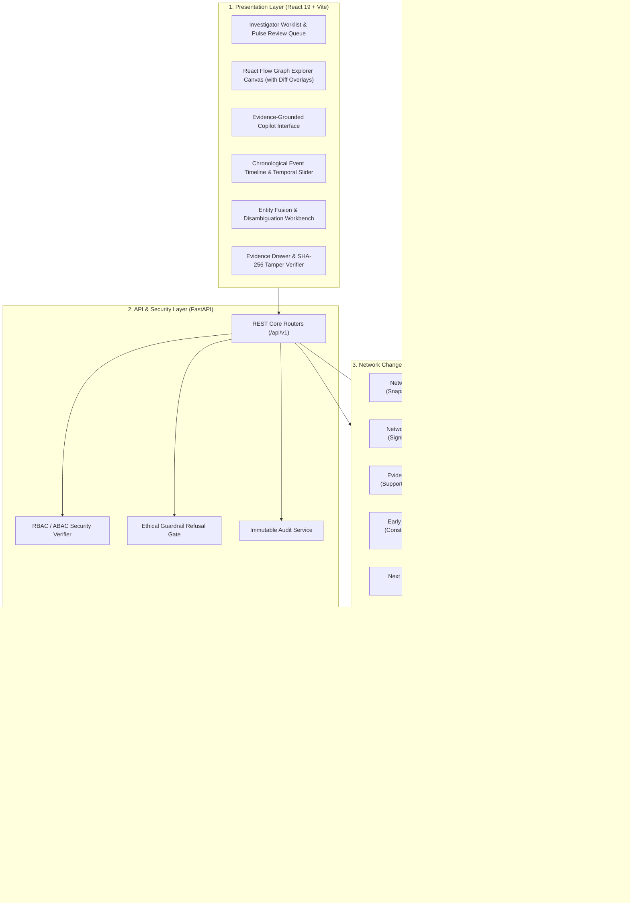

# NEXUS System Architecture

NEXUS is engineered as a **proactive, evidence-grounded criminal network change intelligence platform**. It combines a local-first, hybrid polyglot persistence core with a deterministic network change plane, structured evidence sufficiency evaluation, and role-gated intelligence routing.

---

## 1. High-Level Architectural Diagram

```mermaid
graph TD
    subgraph ClientLayer ["1. Presentation Layer (React 19 + Vite)"]
        Worklist["Investigator Worklist & Pulse Review Queue"]
        RF["React Flow Graph Explorer Canvas (with Diff Overlays)"]
        CopilotUI["Evidence-Grounded Copilot Interface"]
        TimelineUI["Chronological Event Timeline & Temporal Slider"]
        FusionUI["Entity Fusion & Disambiguation Workbench"]
        EvidenceUI["Evidence Drawer & SHA-256 Tamper Verifier"]
    end

    subgraph APILayer ["2. API & Security Layer (FastAPI)"]
        Router["REST Core Routers (/api/v1)"]
        Auth["RBAC / ABAC Security Verifier"]
        RefusalGate["Ethical Guardrail Refusal Gate"]
        AuditSvc["Immutable Audit Service"]
    end

    subgraph ChangePlane ["3. Network Change & Proactive Intelligence Plane"]
        DiffSvc["Network Diff Engine (Snapshot Comparison)"]
        PulseSvc["Network Pulse Service (Significance Filtering)"]
        SufficiencySvc["Evidence Assessment (Supports/Conflicts/Missing)"]
        WarningSvc["Early Warning Engine (Constrained Forecast + Abstention)"]
        VerifyPlanner["Next Best Verification Planner"]
        CrossBranchSvc["Intelligence Pulse Service (Affected-Case Routing)"]
        DriftSvc["Identity Drift & Network Adaptation Radar"]
    end

    subgraph AnalyticsLayer ["4. Graph Analytics & Resolution Engine"]
        ER["Deterministic Multi-Attribute Entity Resolution"]
        Louvain["Louvain Syndicate Community Detection"]
        Centrality["Betweenness Centrality & Bridge Discovery"]
        BFS["Multi-Hop BFS Traversal Engine (<0.025ms)"]
        CaseDNA["Case DNA Explainable Structural Retrieval"]
    end

    subgraph StorageLayer ["5. Polyglot Persistence & Graph Index"]
        MemGraph["In-Memory Double-Adjacency GraphStore (adj & radj)"]
        Postgres["PostgreSQL 16 (Relational State, Cases & Audit Log)"]
        Neo4j["Neo4j 5 Community / AuraDB (Durable Cypher Projection)"]
    end

    ClientLayer --> Router
    Router --> Auth
    Router --> RefusalGate
    Router --> AuditSvc
    Router --> ChangePlane
    Router --> AnalyticsLayer
    ChangePlane --> StorageLayer
    AnalyticsLayer --> StorageLayer
```

---

## 2. Nine-Layer System Breakdown

### Layer 1 — Multi-Source Intelligence Fusion
- **Ingestion Sources:** Police FIR narratives (unstructured), Call Detail Records (CDRs / IPDR), bank transfer logs (IMPS / UPI / NEFT), field intelligence memos, and authorized/public digital signals.
- **Output:** Canonical, provenance-preserving evidence records with cryptographic SHA-256 digests.

### Layer 2 — Identity & Knowledge Graph
- **Core Entities:** 12 modeled entity types (`Person`, `Case`, `Phone`, `Vehicle`, `Location`, `Organization`, `Device`, `Account`, `Transaction`, `Event`, `IntelligenceReport`, `Evidence`).
- **Entity Resolution Engine:** Deterministic multi-attribute resolution using Indian phonetic normalization (`phonetic_normalize`), character-bigram Jaccard similarity, and hard-identifier corroboration (phones, IMEIs, vehicle registrations, national IDs).
- **Human Confirmation:** Automated merges remain suggestions (`PROBABLE_MATCH`, `REVIEW_REQUIRED`) until confirmed or rejected by an authorized investigating officer.

### Layer 3 — Network Change & Temporal Snapshots
- **Snapshots (`GraphSnapshot`):** Deterministic state serialization capturing point-in-time graph topologies.
- **Network Diff Engine (`backend/app/core/graph/algorithms/snapshot_diff.py`):** Pure $O(N + E)$ non-mutating comparison detecting added/removed entities, added/removed relationships, bridge transitions, community splits/merges, and identifier transitions between two snapshots or temporal windows.

### Layer 4 — Network Pulse & Structural Significance
- **Significance Filtering:** Filters raw graph modifications into high-value operational signals (`NetworkPulse`). Routine call logs do not trigger alerts; critical topological phase shifts (bridge emergence to dormant syndicates, sudden identifier shifts, inter-state route changes) generate a Pulse.
- **Review Priority:** Categorizes pulses strictly by investigator review urgency (`CRITICAL_REVIEW`, `PRIORITY_REVIEW`, `ROUTINE_REVIEW`). Zero guilt or dangerousness scores are generated.

### Layer 5 — Evidence Sufficiency & Contradiction Engine
- **Discrete Epistemic States:** Every analytical assertion separates:
  - `SUPPORTS`: Directly substantiated by primary forensic documentation.
  - `CONFLICTS`: Contradicted by independent evidence (e.g. tower location vs. alibi statement).
  - `MISSING`: Relationship suspected but uncorroborated.
  - `INFERRED`: Derived via graph clustering or phonetic similarity.
  - `VERIFIED`: Confirmed by an investigating officer following primary source review.

### Layer 6 — Constrained Early-Warning & Mandatory Abstention
- **Permitted Forecast Targets:** Strictly restricted to operational and topological state transitions (`JURISDICTION_SHIFT`, `COMMUNICATION_PATTERN_SHIFT`, `FINANCIAL_ROUTE_TRANSITION`, `IDENTIFIER_DRIFT`, `NETWORK_RESTRUCTURING`).
- **Prohibited Targets:** Guilt probability, criminal propensity, future crime commission, recidivism risk.
- **Mandatory Abstention Gate:** If evidence is sparse, stale (>90 days), or conflicting, the engine outputs `INSUFFICIENT EVIDENCE / NO FORECAST`.

### Layer 7 — Next Best Verification Planner
- **Actionable Verification:** Maps evidence gaps into recommended investigative verification steps (e.g. subpoena subscriber record, request cross-case CDR, inspect CCTV timestamp).
- **Human Responsibility:** Recommendations are marked as AI suggestions; investigating officers execute and verify findings.

### Layer 8 — Cross-Branch Intelligence Pulse Routing
- **Intelligence Packets:** Structured packets (`IntelligencePulse`) containing source case, affected investigations, observed structural change, attached evidence provenance, action window, and authorization basis.
- **Access Gating:** RBAC/ABAC ensures intelligence is routed only to authorized officers handling affected cases, with full transmission and acknowledgement logged in the audit trail.

### Layer 9 — Trust Fabric, Provenance & Closed-Loop Learning
- **Cryptographic Provenance:** Every relationship edge carries an `EvidenceProvenance` record with source ID, timestamp, fact, and derivation method.
- **SHA-256 Integrity Verification:** Dynamic tamper detection verifies raw source payloads against stored hashes, raising immediate audit alerts upon alteration.
- **Investigator Feedback Loop:** Human confirmations, rejections, and added evidence update the graph, generate a new snapshot, and trigger fresh diff analysis.

---

## 3. Polyglot Persistence Architecture

NEXUS maintains a strict separation across three database layers:

1. **In-Memory `GraphStore` (High-Speed Analytical Plane):**
   - Dual adjacency lists (`adj` and `radj`) indexed by entity and edge type in Python memory.
   - Executes 1-hop, 2-hop, and 3-hop BFS expansions in sub-millisecond time (<0.025ms).
   - Powers interactive UI canvas manipulations, pathfinding, and snapshot diffing without database roundtrips.

2. **Neo4j 5 Community / AuraDB (Durable Graph Projection):**
   - Authoritative graph database for durable Cypher analytics and multi-analyst persistence.
   - Idempotent schema constraints on `NexusNode(id)` and `Case(case_id)`.
   - Parameterized batch synchronization via Cypher `UNWIND ... MERGE`.
   - Bidirectional projection (`read_projection` $\to$ `GraphStore`).
   - Graceful non-fatal fallback when offline.

3. **PostgreSQL 16 (Relational State & Audit):**
   - Case registries, user authentication, RBAC roles, and immutable append-only audit trail.

---

## 4. Scaling & Performance Strategy

To maintain sub-second UI responsiveness across high-volume crime records:
- **Bounded Local Subgraphs:** Canvas expansions default to 2–3 hops rather than full-graph traversals.
- **Deterministic Candidate Blocking:** Entity resolution uses phonetic keys and prefix indexes to bound pairwise comparisons.
- **O(N + E) Snapshot Diffing:** Diff operations compare dictionaries and adjacency sets in linear time without expensive recursive database joins.
- **Graceful Degradation:** Local in-memory graph engine operates completely self-contained if external database connections are lost.
