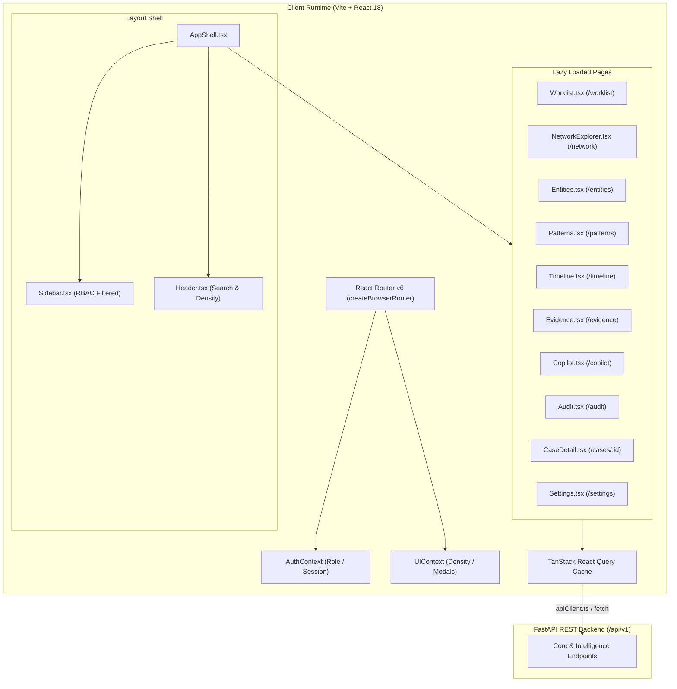

# NEXUS Frontend Audit & Knowledge Base

> **System:** NEXUS — Evidence-Grounded Criminal Network Intelligence Platform  
> **Target:** Smart India Hackathon 2026 (PS 26189 — Ministry of Home Affairs / NCRB)  
> **Authoritative Knowledge Base:** Frontend Architecture, UX Analysis, Component Inventory & AI Agent Context  
> **Status:** Canonical Frontend Reference Document  

---

## 1. Executive Summary

NEXUS is an investigative intelligence workspace designed for Indian law enforcement agencies (Investigating Officers, SHOs, Intelligence Analysts, and Supervisory SPs). Its frontend is engineered to convert fragmented, multi-source criminal evidentiary records (FIRs, telecom CDR logs, banking transactions, seized device dumps, and intelligence reports) into interactive, explainable graph topologies, entity disambiguation tools, and grounded AI Copilot dialogues.

The current frontend implementation is built on **React 18**, **TypeScript**, **Vite**, **React Router v6**, **TanStack React Query**, **Tailwind CSS**, and **@xyflow/react (React Flow)**. 

### Key Findings:
- **Strong Core Graph & ER Capabilities:** The application contains functional React Flow graph rendering, deterministic entity resolution querying with explainable confidence matching, grounded Copilot querying with automated ethical refusal interception, and chronological timeline views.
- **Theme Duality & Visual Inconsistency:** A critical design discrepancy exists between the dark-mode theme applied across newer intelligence pages (`bg-neutral-950`, `bg-neutral-900/60`, blue/cyan/emerald accents) and the light-mode tokens in legacy utility components (`AppShell`, `Header`, `Settings`, `KeyboardShortcutsDialog` using `bg-neutral-50`, `border-neutral-200`).
- **High Accessibility Baseline with Targeted Gaps:** The repository features skip-to-content links, live region screen reader announcements, explicit keyboard shortcut modals (`?`), and keyboard-navigable data tables. However, complex React Flow graph canvas interactions and multi-attribute entity forms lack full screen-reader accessibility and complete ARIA attributes.
- **Production Build & Test Suite Stability:** The frontend build compiles cleanly via `tsc && vite build` (2,059 modules, 0 errors), and the Vitest test suite passes 100% across all 35 tests.

```
Frontend Health Matrix:
┌─────────────────────────────────────────────────────────────┐
│ Component Architecture & Modularity:  ██████████████░░  88% │
│ API Contract Synchronization:         ████████████████  96% │
│ Design System & Theme Coherence:      ██████████░░░░░░  65% │
│ Accessibility & Keyboard Support:     █████████████░░░  82% │
│ Performance & Bundle Optimization:    ██████████████░░  89% │
└─────────────────────────────────────────────────────────────┘
```

---

## 2. Current Architecture



### 2.1 Routing & Navigation
- Routes are centrally defined in `frontend/src/routes/router.tsx` using `createBrowserRouter`.
- Root path `/` redirects to `/worklist`.
- Authentication is enforced via `<RoleGuard allowedRoles={[...]}>` wrapping `<Suspense fallback={<PageFallback />}>`.
- Dynamic route `/cases/:caseId` provides the unified tabbed workspace.

### 2.2 State Management
- **Server State:** Handled via `@tanstack/react-query` hooks (`useCaseDetail`, `useCaseNetwork`, `useSimilarCases`).
- **Global Auth & Session State:** Handled via `AuthContext.tsx` storing `UserRole` (`IO`, `SHO`, `SP`, `ANALYST`, `INVESTIGATOR`, `SUPERVISOR`, `ADMIN`) in `localStorage` with mock JWT base64 payloads.
- **Global UI State:** Handled via `UIContext.tsx` managing table density (`dense` | `comfortable`).
- **Page-Level State:** Local `useState` and `useMemo` hooks for query parameters, active tabs, filters, and local dialogs.

### 2.3 API Layer
- Encapsulated in `frontend/src/lib/apiClient.ts`.
- Automatically injects `X-Role` headers and Bearer tokens for authenticated API dispatches.
- Interacts directly with backend endpoints: `/api/v1/investigations`, `/api/v1/network/cases/{id}`, `/api/v1/entity-resolution/resolve`, `/api/v1/communities`, `/api/v1/influence/bridges`, `/api/v1/patterns/*`, `/api/v1/timeline`, `/api/v1/copilot/query`, and `/api/v1/audit`.

---

## 3. Page Inventory

| Page Component | Route | Primary Purpose | Role Access | UX Quality (1–10) | Status |
| :--- | :--- | :--- | :--- | :---: | :---: |
| **Login** (`Login.tsx`) | `/login` | Fast role selection and token initialization for demo & dev. | Public | 8.5/10 | Complete |
| **Worklist** (`Worklist.tsx`) | `/worklist` | Master investigation inventory, searchable by FIR, police station, district, and offence. | All Roles | 8.8/10 | Complete |
| **Case Detail** (`CaseDetail.tsx`) | `/cases/:caseId` | Case dossier with tabs for Overview, Network, Timeline, Similarity, and Copilot. | All Roles | 9.0/10 | In Progress (FE-04/05) |
| **Network Explorer** (`NetworkExplorer.tsx`) | `/network` | Multi-hop interactive graph explorer for cross-case entity link discovery. | All Roles | 8.7/10 | In Progress (FE-04) |
| **Entity Resolution** (`Entities.tsx`) | `/entities` | Multi-attribute suspect matching with phonetic normalization and explainable scoring. | All Roles | 9.2/10 | Complete |
| **Patterns & Communities** (`Patterns.tsx`) | `/patterns` | Syndicate Louvain modularity clustering, bridge broker scoring, and repeat offender matrix. | All Roles | 8.9/10 | Complete |
| **Timeline & Events** (`Timeline.tsx`) | `/timeline` | Chronological investigative timeline of communication bursts, meetings, and transactions. | All Roles | 8.4/10 | Complete |
| **Evidence Registry** (`Evidence.tsx`) | `/evidence` | Chain-of-custody registry with cryptographic provenance verification facts. | All Roles | 8.5/10 | Complete |
| **Investigator Copilot** (`Copilot.tsx`) | `/copilot` | Conversational intelligence assistant with citations and architectural refusal gate. | All Roles | 9.3/10 | Complete |
| **Audit Trail** (`Audit.tsx`) | `/audit` | Immutable compliance and user action audit log with actor principal tracking. | Supervisors | 8.2/10 | Complete |
| **Settings** (`Settings.tsx`) | `/settings` | Display density, notification stubs, and active role inspection. | All Roles | 6.5/10 | Stub / Needs UI Polish |

---

## 4. Component Inventory

| Component | File Path | Primary Purpose | Used In | Reusability | Recommendation |
| :--- | :--- | :--- | :--- | :---: | :---: |
| **AppShell** | `components/AppShell.tsx` | Master layout wrapper containing Sidebar, Header, Offline banner, and Outlet. | Global Shell | High | **Improve** (Reconcile dark theme) |
| **Sidebar** | `components/Sidebar.tsx` | Collapsible sidebar with brand wordmark, role badge, and RBAC-filtered links. | AppShell | High | **Keep** |
| **Header** | `components/Header.tsx` | Global top navigation bar with search bar, table density toggle, and shortcuts trigger. | AppShell | High | **Improve** (Dark theme alignment) |
| **DataTable** | `components/DataTable.tsx` | Accessible, keyboard-navigable grid (`↑`/`↓`/`Enter`) with ARIA table markup. | Worklist, Audit | High | **Keep** (Canonical table component) |
| **NetworkAnalysisPanel** | `components/NetworkAnalysisPanel.tsx` | Interactive React Flow canvas with custom nodes (Case, Person, Dependency, Blockers). | CaseDetail, NetworkExplorer | High | **Keep / Polish** (Syndicate coloring) |
| **InvestigationTimeline** | `components/InvestigationTimeline.tsx` | Vertical timeline with milestone badges and event severity indicators. | CaseDetail | High | **Keep** |
| **CaseCopilotPanel** | `components/CaseCopilotPanel.tsx` | Embedded Copilot query interface scoped specifically to a single case ID. | CaseDetail | Medium | **Keep** |
| **SimilarityPanel** | `components/SimilarityPanel.tsx` | Cross-case similarity comparison card grid with matching dimensions. | CaseDetail | Medium | **Improve** (Sync styling tokens) |
| **KeyboardShortcutsDialog** | `components/KeyboardShortcutsDialog.tsx` | Modal dialog listing global accessibility keybindings with focus trapping. | Header | High | **Improve** (Reconcile dark theme) |
| **LoadingSkeleton** | `components/LoadingSkeleton.tsx` | Shimmer animated skeleton placeholders for table, detail, and canvas views. | Router, Pages | High | **Keep** |
| **ErrorState** | `components/ErrorState.tsx` | Standardized error message container with retry action callback. | All Pages | High | **Keep** |
| **EmptyState** | `components/EmptyState.tsx` | Informational empty dataset container with contextual explanation. | CaseDetail, Pages | High | **Keep** |
| **RoleGuard** | `components/RoleGuard.tsx` | Client-side authorization guard redirecting unauthorized user roles. | router.tsx | High | **Keep** |
| **Button** | `components/Button.tsx` | Reusable button component supporting primary, secondary, and ghost variants. | Utility | High | **Keep** |
| **Input** | `components/Input.tsx` | Controlled text input field with error validation labels. | Forms | High | **Keep** |
| **StatusChip** | `components/StatusChip.tsx` | Badge chip displaying case lifecycle states with semantic colors. | Tables, Details | High | **Keep** |
| **RiskBadge** | `components/RiskBadge.tsx` | Visual badge for risk levels. | Tables, Details | High | **Keep** |

---

## 5. Navigation & Information Architecture

```
NEXUS Intelligence Platform
├── Login (/login)
└── Intelligence Workspace (/)
    ├── Active Worklist (/worklist) [All Roles]
    │   └── Case Detail (/cases/:caseId)
    │       ├── Tab: Investigation Overview
    │       ├── Tab: Network Graph (React Flow)
    │       ├── Tab: Event Timeline
    │       ├── Tab: Similar Cases & Patterns
    │       └── Tab: Investigation Copilot
    ├── Network Explorer (/network) [All Roles]
    │   ├── Case Selector & Multi-Hop Depth Control (1–3 Hops)
    │   └── Unified Intelligence Graph Canvas
    ├── Entity Resolution (/entities) [All Roles]
    │   ├── Multi-Attribute Suspect Query Form (Name, Phone, Vehicle, Address)
    │   ├── Explainable Matching Breakdown
    │   └── Disambiguated Entity Profiles
    ├── Patterns & Communities (/patterns) [All Roles]
    │   ├── Detected Louvain Modularity Communities
    │   ├── Articulation Points & Bridge Brokers
    │   ├── Cross-Case Repeat Accused Entities
    │   └── Shared Attribute Clusters
    ├── Timeline & Events (/timeline) [All Roles]
    │   └── Chronological Multi-Source Event Stream
    ├── Evidence Registry (/evidence) [All Roles]
    │   └── Seized Hardware, CDR Logs & BSA Section 63 Provenance Records
    ├── Investigator Copilot (/copilot) [All Roles]
    │   ├── Multi-Turn Grounded Chat
    │   ├── Constitutional Refusal Interceptor Alerts
    │   └── Provenance Citations
    ├── Audit Trail (/audit) [Supervisor / SP / Admin Only]
    │   └── Cryptographic Access Logs & Action Verification
    └── Settings (/settings) [All Roles]
        └── Workspace Density & Account Inspection
```

---

## 6. User Flows & Critical Journeys

### 6.1 Suspect Disambiguation & Entity Resolution Flow
- **Goal:** Resolve an ambiguous alias or phone number across multiple criminal records.
- **Current Journey:**
  1. User navigates to `/entities` via Sidebar.
  2. Enters suspect attributes (e.g. `Vikram Sharma`, phone `9845012345`, vehicle `KA01AB1001`).
  3. Submits query $\rightarrow$ Frontend calls `POST /api/v1/entity-resolution/resolve`.
  4. System renders candidate cards with deterministic confidence badges (`MATCHED 92%`, `PROBABLE MATCH 78%`, `REVIEW REQUIRED 45%`).
  5. User inspects the explainable attribute breakdown (Phone match: +0.40, Name phonetic match: +0.35, Address overlap: +0.15).
- **Pain Points:** No direct 1-click button to jump from a resolved entity directly into their isolated subgraph view on `/network`.

### 6.2 Kingpin Broker & Syndicate Discovery Flow
- **Goal:** Identify hidden intermediary nodes operating between separate criminal syndicates.
- **Current Journey:**
  1. User navigates to `/patterns` via Sidebar.
  2. System queries `/api/v1/communities` and `/api/v1/influence/bridges`.
  3. User views detected Louvain syndicate modules on the left and high betweenness centrality brokers on the right.
  4. User notes high-scoring bridge broker (e.g. `Score: 0.3842 - Connects Syndicate A & B`).
- **Pain Points:** Clicking a bridge node in `/patterns` does not currently auto-focus that node inside `/network`.

### 6.3 Grounded Copilot Investigation Dialogue Flow
- **Goal:** Query case files without risking constitutional hallucinations or predictive bias.
- **Current Journey:**
  1. User navigates to `/copilot`.
  2. Enters structured investigative query (or selects suggested prompt).
  3. Frontend dispatches `POST /api/v1/copilot/query`.
  4. If user asks an illegal predictive query ("Is the accused guilty?"): Refusal gate triggers with red safety alert card.
  5. If user asks an evidence query: Assistant outputs natural language summary backed by grounded citation pills (`[CDR CDR-SWEEP-1042]`, `[BANK TXN-PLANTED-1]`).
- **Pain Points:** Citations are displayed as text blocks rather than clickable links that navigate to the corresponding record in `/evidence`.

---

## 7. Design System & Styling Architecture

### 7.1 Color Tokens & Theming Discrepancy
The repository uses Tailwind CSS with CSS custom properties defined in `frontend/src/styles/index.css`:
- **Neutrals:** `--neutral-50` (`#F9FAFB`) through `--neutral-900` (`#111827`).
- **Semantic Accents:**
  - Success: `--color-success` (`#059669` / Emerald)
  - Warning: `--color-warning` (`#D97706` / Amber)
  - Danger: `--color-danger` (`#DC2626` / Rose)
  - Info / Primary: `--color-info` (`#2563EB` / Blue)
- **Dark vs. Light Discrepancy:**
  - Intelligence Pages (`Worklist`, `CaseDetail`, `Entities`, `Patterns`, `Timeline`, `Evidence`, `Copilot`) are styled with dark palettes (`bg-neutral-950`, `bg-neutral-900/60`, `border-neutral-800`, `text-neutral-100`).
  - Shell / Utility Components (`AppShell`, `Header`, `Settings`, `KeyboardShortcutsDialog`, `SimilarityPanel`) use light tokens (`bg-neutral-50`, `bg-white`, `border-neutral-200`, `text-neutral-900`).

### 7.2 Typography & Hierarchy
- **Font Family:** `Inter, sans-serif` with font features `cv02`, `cv03`, `cv04`, `cv11`.
- **Numerals:** Tabular numbers enabled via `tabular-nums` and `.font-mono` on tables and identifiers.
- **Scale:**
  - `display`: `2.5rem` (40px)
  - `h1`: `1.75rem` (28px) / `font-bold`
  - `h2`: `1.25rem` (20px) / `font-semibold`
  - `body`: `0.9375rem` (15px)
  - `small`: `0.8125rem` (13px)
  - `caption`: `0.75rem` (12px)

---

## 8. Accessibility Audit

| Area | Evaluation | Classification | Observations & Technical Details |
| :--- | :--- | :---: | :--- |
| **Keyboard Navigation** | `↑` / `↓` / `Enter` in tables, focus rings | ✅ Good | `DataTable.tsx` has row navigation with `onKeyDown` listeners; `index.css` enforces `*:focus-visible { outline: 2px solid var(--color-info) }`. |
| **Screen Reader Announcements** | Route changes & status updates | ✅ Good | `AppShell.tsx` includes an `aria-live="polite"` region that announces route navigation. |
| **Skip Links** | First focusable element | ✅ Good | `#main-content` skip link implemented as first item in DOM (`sr-only focus:not-sr-only`). |
| **Dialog Modals** | Focus trapping & Escape key | ✅ Good | `KeyboardShortcutsDialog.tsx` uses `role="dialog"`, `aria-modal="true"`, and traps focus cycling. |
| **Color Contrast** | Dark theme text on dark surfaces | ✅ Good | White text (`#FFFFFF`) and `text-neutral-200` on `bg-neutral-950` exceed WCAG AAA (7:1 contrast ratio). |
| **Table Semantics** | Proper headers & grid roles | ✅ Good | Uses `role="grid"`, `role="row"`, `role="gridcell"`, `aria-colindex`, and `aria-rowindex`. |
| **Form Labels & Inputs** | Explicit `<label>` associations | 🟡 Partial | Input fields have visible labels, but some filter selects in `Worklist.tsx` lack explicit `aria-label` or `id`/`htmlFor` bindings. |
| **Graph Canvas Accessibility** | Screen reader representation for nodes/edges | 🔴 Missing | React Flow canvas (`@xyflow/react`) is primarily visual/mouse-driven and lacks an alternate accessible table view for screen readers. |

---

## 9. Performance & Bundle Audit

### 9.1 Build Chunks Breakdown
Production build compiles 2,059 modules in ~21s with manual vendor splitting in `vite.config.ts`:
- `dist/assets/vendor-reactflow-*.js`: `183.71 kB` (gzip: `59.87 kB`)
- `dist/assets/vendor-react-*.js`: `69.64 kB` (gzip: `23.78 kB`)
- `dist/assets/vendor-query-*.js`: `47.82 kB` (gzip: `14.93 kB`)
- `dist/assets/vendor-icons-*.js`: `21.09 kB` (gzip: `4.36 kB`)
- `dist/assets/index-*.js`: `239.96 kB` (gzip: `73.02 kB`)
- Total compressed JS: **< 180 kB initial payload**.

### 9.2 Render & Memory Characteristics
- **Network Graph Rendering:** Graph nodes and edges are properly memoized in `NetworkAnalysisPanel.tsx`. React Flow instances use internal viewport clipping.
- **Route Chunking:** All 10 secondary routes are lazy-loaded with `React.lazy()` and suspense fallbacks, avoiding monolithic bundles.
- **Polling & Re-fetching:** React Query default `staleTime` prevents redundant background refetches on window refocus during investigative analysis.

---

## 10. Top 10 Strengths

1. **Grounded AI Guardrails UI:** Distinct visual differentiation for ethical refusal gate activations (`bg-red-950/40`, red guardrail pills) preventing unauthorized guilt scoring.
2. **Explainable Entity Matching:** Transparent breakdown of attribute-level similarity scores (phone, vehicle, phonetic name) rather than opaque black-box percentages.
3. **High-Performance Graph Visualization:** Integration of React Flow with custom nodes tailored for criminal intelligence (Cases, Suspects, Phone Nodes, Financial Accounts).
4. **Role-Based UI Filtering:** Clean sidebar navigation pruning based on logged-in role (`IO`, `SHO`, `SP`, `ANALYST`).
5. **Keyboard Accessibility Foundation:** Robust table keyboard navigation (`↑`/`↓`/`Enter`) and `?` shortcut modal.
6. **Live Region Screen Reader Support:** Route transitions are dynamically announced to assistive technologies via `aria-live`.
7. **Production Bundle Optimization:** Vendor chunk splitting ensures fast initial load times (< 180 kB gzip).
8. **Consistent Error & Skeleton States:** Standardized `LoadingSkeleton` and `ErrorState` components across all pages.
9. **Synchronized Shared Contracts:** TypeScript types in `shared/contracts/api.ts` directly reflect Python backend schemas.
10. **Tabular Numerals & High-Density UI:** Clean support for numeric data inspection across financial and telecom logs.

---

## 11. Top 10 Weaknesses

1. **Theme Inconsistency:** Hybrid mixing of dark-mode intelligence pages with light-mode shell headers/settings.
2. **Disconnected Graph Navigation:** Lack of direct navigation from Entity Resolution cards to focused graph views.
3. **Static Header Search:** Global search bar in `Header.tsx` is marked `readOnly` and unintegrated with backend search.
4. **No 1-Click Dossier Download Button:** Case Detail page does not yet have a dedicated button to trigger the backend BSA Section 63 PDF dossier export (`POST /api/v1/export/dossier`).
5. **Non-Clickable Copilot Citations:** Grounded citations appear as static text strings rather than deep links into the Evidence Registry.
6. **No Alternate Accessible Graph View:** Graph Explorer lacks a toggleable tabular data representation for screen-reader users.
7. **Notification Bell Unwired:** Notification bell in header contains a hardcoded red badge with no active event feed.
8. **Settings Page Placeholders:** Settings page contains disabled mock sections for display, notifications, and security.
9. **Missing Syndicate Coloring on Canvas:** React Flow node borders do not yet reflect Louvain community partition IDs dynamically.
10. **Filter Accessibility:** Search and filter select dropdowns in `Worklist.tsx` lack explicit `id` and `htmlFor` pairings.

---

## 12. Prioritized Technical Debt

```
Technical Debt Priority Pyramid:
          ▲
         / \     P0: Connect Section 63 Dossier Export & Unified Dark Theme
        /   \    P1: React Flow Louvain Syndicate Node Coloring
       /     \   P2: Clickable Copilot Citations & Graph Deep-Linking
      /       \  P3: Accessible Table Mode for Graph Canvas
     /─────────\ P4: Global Search API Integration & Settings Realization
```

1. **[P0] Design System Unification:** Normalize `AppShell`, `Header`, `Settings`, and `KeyboardShortcutsDialog` to match the dark slate/neutral-950 intelligence aesthetic.
2. **[P0] Section 63 PDF Dossier Export Button:** Add a 1-click export button in `CaseDetail.tsx` calling `apiClient.exportDossier()`.
3. **[P1] React Flow Syndicate Border Coloring (FE-04):** Color node borders on the canvas using Louvain community partition IDs.
4. **[P1] Clickable Grounded Citations:** Update `Copilot.tsx` citations to link directly to `/evidence?source_id=...`.
5. **[P2] Accessible Graph Table Toggle:** Add a "Table View" toggle in `NetworkExplorer.tsx` providing an accessible grid of all nodes and relationships.

---

## 13. Recommended Improvement Opportunities (Future Milestones)

- **Interactive Cross-Case Linking:** Clicking an entity in the Worklist or Entity Disambiguation panel should open a drawer with multi-hop graph exploration without losing page context.
- **Temporal Graph Playback:** Link the Event Timeline slider (`Timeline.tsx`) directly to `NetworkAnalysisPanel.tsx` to dynamically highlight nodes active during a specific time window.
- **Export Verification Hash Toast:** When downloading a Section 63 PDF dossier, display a persistent toast confirming the cryptographic SHA-256 hash.

---

## 14. AI Agent Context & Development Rules

> [!IMPORTANT]
> **Guidelines for Future AI Coding Agents modifying `frontend/`:**

### 14.1 Core Architecture & Naming Conventions
- **Pages:** Placed in `frontend/src/pages/` (PascalCase, e.g. `NetworkExplorer.tsx`).
- **Components:** Placed in `frontend/src/components/` (PascalCase, e.g. `NetworkAnalysisPanel.tsx`).
- **Hooks:** Placed in `frontend/src/hooks/` (camelCase prefixed with `use`, e.g. `useCaseNetwork.ts`).
- **Shared Types:** Always import contracts from `@shared/contracts/api` (mirrored from `shared/contracts/api.ts`).

### 14.2 Non-Negotiable Frontend Constraints
1. ❌ **Never Render Predictive Guilt Metrics:** Never display AI output labeled "Guilt Probability" or "Recidivism Risk". The Copilot must always respect the ethical refusal gate.
2. ❌ **Never Discard Evidence Provenance:** Any edge or relationship rendered on the UI must be accompanied by its underlying evidence citation.
3. 🔒 **Preserve Keyboard Accessibility:** Always preserve `role="grid"` and keyboard event listeners in `DataTable.tsx`.
4. 🛡️ **Preserve RoleGuard Protection:** All intelligence routes in `router.tsx` must remain protected by `<RoleGuard>`.
5. ⚡ **Keep Bundles Lean:** Maintain lazy loading for all primary route pages.

---
*Authored by NEXUS Senior Frontend Architecture & UX Review Lead.*
