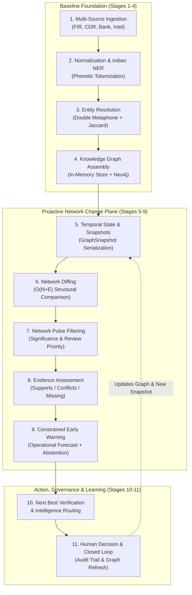

# NEXUS — Intelligence Processing Pipeline

The NEXUS intelligence pipeline transforms heterogeneous, unstructured, and noisy crime records into an evidence-grounded, proactive network intelligence workspace.

---

## 1. The 11-Stage Proactive Intelligence Lifecycle

NEXUS evolves from a 7-stage retrospective graph pipeline into an **11-stage proactive intelligence lifecycle**:

---

## 2. Detailed Pipeline Stage Breakdown

### Stage 1: Multi-Source Ingestion
- **Implementation Status:** **CURRENT / IMPLEMENTED**
- **Input:** Unstructured FIR text narratives, structured CSV CDR telephony logs, bank transfer ledgers (IMPS/UPI/NEFT), field intelligence memos.
- **Processing:** Validates column formats, sanitizes input strings, and canonicalizes records into standard JSON schemas.
- **Output:** Canonical ingestion payload with computed SHA-256 raw digests.

### Stage 2: Entity Normalization & Extraction
- **Implementation Status:** **CURRENT / IMPLEMENTED**
- **Input:** Raw narrative text and telemetry records.
- **Processing:** Extracts phone numbers (10-digit MSISDN), vehicle registrations (e.g. `KA01AB1001`), bank account numbers, and person names. Applies custom Indian phonetic normalization (`phonetic_normalize`) handling regional variations (`sh` ↔ `s`, `v` ↔ `b`, `ee` ↔ `i`, `ou` ↔ `u`).
- **Output:** Normalized entity candidate attributes.

### Stage 3: Explainable Entity Resolution (Disambiguation)
- **Implementation Status:** **CURRENT / IMPLEMENTED** (100% Precision / Recall on Ground-Truth Benchmark)
- **Input:** Suspect candidate records vs. active graph person profiles.
- **Processing:** Multi-factor weighted corroboration scoring:
  - Indian Phonetic Match (Double Metaphone)
  - Character-bigram Jaccard name similarity
  - Hard-identifier corroboration (shared phone, IMEI, vehicle, national ID)
- **Output:** Match score ($0.0 - 1.0$), confidence tier (`MATCHED`, `PROBABLE_MATCH`, `REVIEW_REQUIRED`), and mathematical evidence contribution breakdown.

### Stage 4: Knowledge Graph Construction & Projection
- **Implementation Status:** **CURRENT / IMPLEMENTED**
- **Input:** Normalized entities and typed relationships.
- **Processing:** Constructs in-memory `GraphStore` with dual adjacency lists (`adj` and `radj`). Simultaneously synchronizes durable graph projections into Neo4j 5 using parameterized batch Cypher `UNWIND ... MERGE`.
- **Output:** High-speed in-memory graph index (<0.025ms BFS) with disk-backed Neo4j durability.

### Stage 5: Temporal State & Snapshot Serialization
- **Implementation Status:** **EXTENSION / IN PROGRESS**
- **Input:** Graph state at discrete chronological intervals or after ingestion batches.
- **Processing:** Generates immutable `GraphSnapshot` records with version hashes, node counts, and edge counts.
- **Output:** Queryable point-in-time graph state.

### Stage 6: Deterministic Network Diffing
- **Implementation Status:** **CURRENT IN ENGINE (`snapshot_diff.py`) / API EXTENSION IN PROGRESS**
- **Input:** Two graph snapshots (`snapshot_before`, `snapshot_after`) or temporal boundaries.
- **Processing:** Executes pure, non-mutating $O(N + E)$ comparison. Identifies added/removed nodes, added/removed relationships, bridge transitions, and property modifications.
- **Output:** Typed `GraphSnapshotDiff` containing structural change metrics.

### Stage 7: Network Pulse & Structural Significance Filtering
- **Implementation Status:** **ROADMAP P0 / NEXT PROTOTYPE**
- **Input:** Raw `GraphSnapshotDiff` events.
- **Processing:** Filters out routine edge changes; scores structural significance based on bridge emergence to dormant syndicates, identifier shifts, or cross-jurisdictional financial movement.
- **Output:** Qualified `NetworkPulse` records assigned review priority (`CRITICAL_REVIEW`, `PRIORITY_REVIEW`, `ROUTINE_REVIEW`).

### Stage 8: Evidence Assessment & Contradiction Checking
- **Implementation Status:** **ROADMAP P0 / NEXT PROTOTYPE**
- **Input:** Claimed relationships within a `NetworkPulse`.
- **Processing:** Evaluates evidence completeness and consistency. Classifies supporting records into `SUPPORTS`, `CONFLICTS`, `MISSING`, `INFERRED`, or `VERIFIED`.
- **Output:** `EvidenceAssessment` report with provenance chains and freshness metrics.

### Stage 9: Constrained Early Warning & Mandatory Abstention
- **Implementation Status:** **ROADMAP P0 / NEXT PROTOTYPE**
- **Input:** Verified `NetworkPulse` and `EvidenceAssessment`.
- **Processing:** Forecasts narrowly defined operational state transitions (`JURISDICTION_SHIFT`, `COMMUNICATION_PATTERN_SHIFT`, `IDENTIFIER_DRIFT`, `NETWORK_RESTRUCTURING`). If evidence is sparse, stale, or contradictory, triggers mandatory abstention (`INSUFFICIENT EVIDENCE / NO FORECAST`).
- **Output:** `Forecast` object with explicit uncertainty bounds and action windows.

### Stage 10: Next Best Verification & Intelligence Pulse Routing
- **Implementation Status:** **ROADMAP P0/P1 / NEXT PROTOTYPE**
- **Input:** Missing evidence gaps and cross-case bridge detections.
- **Processing:** Suggests role-aware verification plans (e.g. subpoena subscriber data). Dispatches structured `IntelligencePulse` packets to authorized investigators handling affected cases across police stations.
- **Output:** Actionable verification recommendations and dispatched intelligence packets.

### Stage 11: Human Decision, Audit & Closed-Loop Graph Update
- **Implementation Status:** **CURRENT BASELINE (AUDIT & COPILOT) / EXTENSION FOR PULSES**
- **Input:** Investigating officer actions (confirm candidate match, acknowledge pulse, resolve verification).
- **Processing:** All decisions are immutably logged via `AuditService`. Confirmed relationships are merged into the graph, generating a new snapshot revision that feeds back into Stage 5.
- **Output:** Updated knowledge graph with verified judicial provenance.
