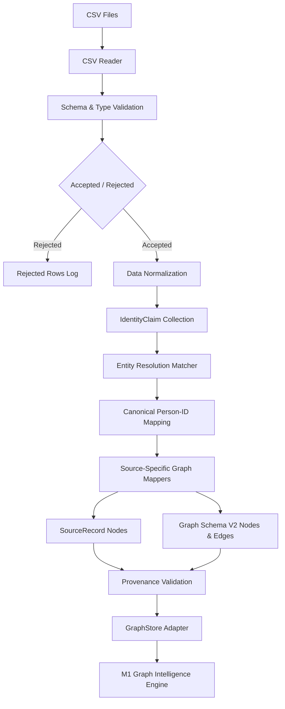

# NEXUS M2 — CSV Ingestion and Entity Resolution

- **Project**: NEXUS
- **Problem Statement**: SIH 2026 PS 26189
- **Organization**: MHA / NCRB Women Safety Division
- **Member**: Vikram
- **Workstream**: M2 — Data Ingestion and Entity Resolution
- **Branch name**: feature/Data-Entity-Resolution
- **Current commit hash**: db6dd0d
- **Documentation date**: 2026-08-25
- **Implementation status**: Implemented and Hardened
- **Supported prototype sources**: FIR, CDR, Bank Transactions, Intelligence Reports
- **Note**: All demo data is strictly synthetic.

## 1. Executive Summary

The M2 implementation solves the challenge of ingesting fragmented, heterogeneous law enforcement data (FIRs, CDRs, Bank Transactions) from flat CSV files, and resolving the underlying human identities across these distinct sources into unified graph nodes. By reading raw CSV records, normalizing fields, detecting duplicates, and executing conservative entity resolution rules, M2 creates a clean, deterministic `GraphStore` bundle. This resolved and strongly-provenanced data is the foundation that enables the M1 graph intelligence algorithms to find hidden networks and compute centralities without operating on duplicated or fragmented data. The current prototype only supports CSV file ingestion.

## 2. Responsibility and Ownership Boundary

**Vikram's Exact Ownership (M2):**
- FIR CSV ingestion
- CDR CSV ingestion
- Bank transaction CSV ingestion
- Intelligence report CSV ingestion
- Validation (schema, types, logic)
- Normalization (phones, IFSC, amounts, dates)
- Duplicate detection (exact row duplication)
- Entity resolution (deterministic matching, REVIEW_REQUIRED flagging)
- Graph mapping (Schema V2)
- SourceRecord provenance tracking
- Data quality reporting (accepted, rejected, conflicts)

**Out of Scope (Not Owned by Vikram):**
- Graph algorithms and intelligence (M1)
- API authentication and audit integration (M3)
- Frontend workspace and UI (M4)
- Database persistence (PostgreSQL/Neo4j)
- Copilot functionality
- Evidence dossier generation

**Responsible Handoffs:**
- **M1 (Graph owner)** consumes the generated `GraphStore` for pattern rules and community detection.
- **M3 (Sujal/Backend)** connects this pipeline to `/api/v1/ingest`.
- **M4 (Frontend)** displays the ingestion summary, review queues, and parsed entities.

## 3. Why the Implementation Belongs in the Backend

The entire ingestion architecture was moved from `synthetic_data/parsers/` (an untracked M2 scratch location) into `backend/app/db/ingestion/`. 
- `synthetic_data/` is strictly intended for generating synthetic demo data, not for operational backend code.
- Production-style file parsing, data quality checks, and resolution are backend responsibilities.
- Placing this logic under `backend/app/db/` perfectly respects the M1 handoff boundary (generating a GraphStore) while remaining strictly within the M2 Data/Ingestion ownership boundary.
- This avoids commingling runtime logic with test data generation.
- It completely avoids modifying M3-owned API routes or core services.

## 4. Complete Directory Structure

```text
backend/app/db/ingestion/
├── __init__.py
├── cli.py
├── contracts.py
├── csv_reader.py
├── graph_adapter.py
├── identifiers.py
├── normalization.py
├── pipeline.py
├── quality.py
├── mappers/
│   ├── __init__.py
│   ├── bank.py
│   ├── cdr.py
│   ├── fir.py
│   └── intelligence.py
├── parsers/
│   ├── __init__.py
│   ├── bank.py
│   ├── cdr.py
│   ├── fir.py
│   └── intelligence.py
└── resolution/
    ├── __init__.py
    ├── evaluator.py
    ├── matcher.py
    └── registry.py

tests/ingestion/
├── __init__.py
├── test_bank_parser.py
├── test_cdr_parser.py
├── test_cli.py
├── test_csv_reader.py
├── test_entity_resolution.py
├── test_fir_parser.py
├── test_identifiers.py
├── test_identity_registry.py
├── test_ingestion_contracts.py
├── test_intelligence_parser.py
├── test_normalization.py
├── test_pipeline.py
└── test_quality.py

tests/data/fixtures/m2_csv/
├── bank_transactions.csv
├── cdr_records.csv
├── entity_resolution_ground_truth.csv
├── fir_records.csv
├── intelligence_records.csv
└── README.md
```

## 5. Complete File Inventory

| File | Status | Responsibility | Why It Was Added | Key Classes/Functions | Used By | Tests |
| :--- | :--- | :--- | :--- | :--- | :--- | :--- |
| `contracts.py` | Migrated | Pydantic data schemas | Decouple parser output from graph schemas | `ParsedSourceBundle`, `IngestionBundle` | Parsers, Pipeline | `test_ingestion_contracts.py` |
| `csv_reader.py` | Migrated | Safe CSV parsing | Validate headers and track rows safely | `read_csv_file`, `parse_csv_text` | Parsers | `test_csv_reader.py` |
| `normalization.py` | Migrated | Data cleaning | Ensure IDs/dates/phones are standard | `normalize_phone`, `parse_utc_datetime` | Parsers, Resolution | `test_normalization.py` |
| `identifiers.py` | Migrated | UUID generation | Generate deterministic UUIDs | `make_source_record_id`, `stable_uuid` | Parsers, Mappers | `test_identifiers.py` |
| `quality.py` | Migrated | Metric aggregation | Compute exact rejection/duplicate counts | `calculate_ingestion_summary` | Pipeline | `test_quality.py` |
| `graph_adapter.py` | Migrated | Graph mapping | Convert objects to M1 `GraphStore` | `build_m1_graph_store` | Pipeline | `test_pipeline.py` |
| `pipeline.py` | Migrated | Orchestration | Execute parsing -> resolution -> mapping | `CsvIngestionPipeline` | API, CLI | `test_pipeline.py` |
| `cli.py` | Migrated | Trial execution | Provide CLI for testing ingestion | `run_trial` | Terminal | `test_cli.py` |
| `parsers/fir.py` | Migrated | FIR parsing | Read FIR specific rows | `parse_fir_source_file` | Pipeline | `test_fir_parser.py` |
| `parsers/cdr.py` | Migrated | CDR parsing | Read CDR specific rows | `parse_cdr_source_file` | Pipeline | `test_cdr_parser.py` |
| `parsers/bank.py` | Migrated | Bank parsing | Read Bank specific rows | `parse_bank_source_file` | Pipeline | `test_bank_parser.py` |
| `parsers/intelligence.py` | Migrated | Intel parsing | Read Intel specific rows | `parse_intelligence_source_file` | Pipeline | `test_intelligence_parser.py` |
| `mappers/fir.py` | Migrated | FIR mapping | Map FIR rows to nodes | `map_fir_bundle` | Pipeline | `test_fir_parser.py` |
| `mappers/cdr.py` | Migrated | CDR mapping | Map CDR rows to nodes | `map_cdr_bundle` | Pipeline | `test_cdr_parser.py` |
| `mappers/bank.py` | Migrated | Bank mapping | Map Bank rows to nodes | `map_bank_bundle` | Pipeline | `test_bank_parser.py` |
| `mappers/intelligence.py` | Migrated | Intel mapping | Map Intel rows to nodes | `map_intelligence_bundle`| Pipeline | `test_intelligence_parser.py` |
| `resolution/matcher.py` | Migrated | Entity match logic | Decide if two identities are the same | `decide_candidates` | Pipeline | `test_entity_resolution.py` |
| `resolution/registry.py` | Migrated | Identity Indexing | Deterministically resolve anchor identities | `IdentityRegistry` | Pipeline | `test_identity_registry.py` |
| `resolution/evaluator.py`| Migrated | Ground-truth metrics| Compute TP/FP/FN/TN safely | `evaluate_ground_truth` | QA Scripts | `test_entity_resolution.py` |

## 6. End-to-End Processing Flow


**Explanation:**
The ingestion pipeline reads CSV data with strict row tracking. Validation enforces required types. Accepted rows are normalized and transformed into `IdentityClaim` representations. The Entity Resolution layer then maps provisional entity references to a stable canonical `Person` ID. Source-specific mappers construct the formal `GraphEntityBase` and `GraphEdge` elements (Schema V2) alongside `SourceRecord` metadata. The `GraphStoreAdapter` finally packages these elements for direct consumption by M1 algorithms.

## 7. Supported CSV Sources

### 7.1 FIR CSV
- **Exact Supported Header:** `record_id,fir_number,year,district,police_station,incident_time,crime_category,penal_code,person_name,person_role,phone_number,vehicle_number,address,national_id`
- **Required Fields:** `record_id`, `fir_number`, `year`, `person_name`, `person_role`
- **Optional Fields:** `phone_number`, `vehicle_number`, `address`, `national_id`
- **Validation Rules:** Timestamp must be ISO-8601, roles must match predefined ENUMs.
- **Nodes Produced:** `Case`, `Person`, `Phone`, `Vehicle`, `Location`, `SourceRecord`
- **Relationships Produced:** `ACCUSED_IN`, `VICTIM_IN`, `COMPLAINANT_IN`, `WITNESS_IN`, `USED_PHONE`, `USED_VEHICLE`, `OCCURRED_IN`
- **Rejection Conditions:** Malformed date, blank name, unknown role.
- **Example Synthetic Row:** `fir_001,FIR-123,2026,Central,Bengaluru,2026-08-24T10:00:00Z,theft,303,Vikram Sharma,ACCUSED,+91 98450-12345,KA-01-AB-1234,Synthetic Road,SYN-NID-001`

### 7.2 CDR CSV
- **Exact Supported Header:** `record_id,caller_phone,callee_phone,call_time,duration_seconds,call_type,timestamp,caller_imei,callee_imei,subscriber_name,subscriber_national_id,subscriber_address`
- **Required Fields:** `record_id`, `caller_phone`, `callee_phone`, `call_time`, `duration_seconds`, `call_type`
- **Optional KYC Fields:** `subscriber_name`, `subscriber_national_id`, `subscriber_address`
- **Validation Rules:** Valid duration integers, valid dates, normalized Indian phone numbers.
- **Mapping Strategy:** `Phone` to `Phone` `COMMUNICATED_WITH`. `Person` to `Phone` `USED_PHONE` (if KYC present).
- **Forbidden Edges:** CDRs establish communication between devices, not people. Direct Person-to-Person edges are strictly prohibited.
- **Repeated Calls:** Preserved via distinct relationship UUIDs reflecting exact timestamps.
- **Example Synthetic Row:** `cdr_001,+91 98450-12345,98450-67890,2026-08-24T14:05:00Z,60,OUTGOING,2026-08-24T14:06:00Z,IMEI-A,IMEI-B,Vikram Sharma,SYN-NID-001,Synthetic Road`

### 7.3 Bank Transaction CSV
- **Exact Supported Header:** `record_id,utr,from_account,from_bank,to_account,to_bank,amount,currency,timestamp,from_ifsc,from_holder_name,from_holder_national_id,to_ifsc,to_holder_name,to_holder_national_id`
- **Required Fields:** `record_id`, `utr`, `from_account`, `from_bank`, `to_account`, `to_bank`, `amount`, `currency`, `timestamp`
- **Optional KYC Fields:** `from_ifsc`, `from_holder_name`, etc.
- **Decimal Amount Handling:** Parsed precisely and validated strictly as non-negative floats.
- **Mapping Strategy:** `Account` to `Account` `TRANSFERRED_FUNDS`. `Person` to `Account` `OWNS_ACCOUNT`.
- **Repeated Transfers:** Maintained as distinct edges by incorporating UTR into the edge UUID hash.
- **Example Synthetic Row:** `bank_001,SYN-UTR-001,SYN-ACC-001,Bank,SYN-ACC-002,Trust,1000.00,INR,2026-08-24T10:00:00Z,SBIN0001234,V. Sharma,SYN-NID-001,HDFC0002345,R. Kumar,SYN-NID-002`

### 7.4 Ground-Truth CSV
- **Exact Header:** `record_id_a,record_id_b,expected_same_entity,reason`
- **Purpose:** Used strictly for non-operational automated benchmark tests to evaluate precision and recall of the resolution engine.
- **Evaluation:** Measures predicted pair links against explicitly labelled pairs. True positives and hard negatives are computed exactly.
- **Operational Ban:** Ground-truth files are never ingested into the actual running graph database.

### 7.5 Intelligence CSV
- **Exact Supported Header:** `record_id,report_id,report_date,source_agency,classification,subject_name,summary,alias,phone_number,national_id,organization,district`
- **Required Fields:** `record_id`, `report_id`, `report_date`, `source_agency`, `classification`, `subject_name`
- **Optional Fields:** `alias`, `phone_number`, etc.
- **Validation Rules:** Required headers and standard timestamp normalization.

## 8. Validation and Data-Quality Handling
Data ingestion undergoes rigid validation:
- **Headers & Types**: Required columns are checked. Dates/decimals/phones must pass format checks.
- **Blank Handling**: Empty optional fields are safely dropped. Blank rows are quarantined.
- **Exact Duplicate Detection**: Repeated exact CSV rows are discarded cleanly.
- **Conflicting Duplicate Detection**: Mismatched values for the same `record_id` emit separate instances with distinct warnings.
- **Statistics**: Exact metrics are recorded for accepted rows, duplicates, and severity-level (WARNING/ERROR) rejected rows.

## 9. Normalization Strategy
Both the normalized (system-use) and original (raw) variants are preserved. Normalization enables deterministic entity matching without permanently destroying the original field text submitted by the user.
- **Names**: Lowercased, stripped, phonetic indexing.
- **Phones**: Normalized to standard ten-digit or international format.
- **National IDs**: Case standardized.
- **IFSC / Accounts / Vehicles**: Stripped and zero-preserved for financial precision.
- **Timestamps**: Normalized to strictly UTC.
- *Note:* Normalization alone is a prerequisite for matching, but does not prove identity equivalence by itself.

## 10. Deterministic Identifier Strategy
UUIDs are generated using `stable_uuid()` seeded with canonical data rather than random UUID4 strings.
- **Why**: Allows idempotent re-ingestion, avoids graph duplication on multi-pass runs, and permits strict cross-snapshot comparisons.
- **Relationship IDs**: Includes timestamp, UTR, or call duration parameters within the hash to ensure multiple interactions between identical entities remain as distinct edge instances.
- **Provisional vs Canonical Person IDs**: Provisional IDs are localized to a specific source record; Canonical IDs represent the resolved global identity within the database.

## 11. Entity Resolution

**Existing M1 graph-level entity resolution**:
- Found in `backend/app/core/graph/algorithms/entity_resolution.py`. Owned by M1 and used to evaluate GraphStore structures post-ingestion.

**M2 ingestion-time entity resolution**:
- Resides in `backend/app/db/ingestion/resolution/`.
- Converts rows into standard `IdentityClaim` objects.
- Uses `IdentityRegistry` for indexing identities by strong fields.
- Uses `matcher.py` decision logic.
- Maintains a Human Review queue for ambiguous mappings.

**Decision Policy**:
- **MATCHED**: Automatically linked when exact Verified National ID matches with no phone conflict, or when two strong corroborating fields match.
- **REVIEW_REQUIRED**: Ambiguous records. Name alone, phonetic name alone, or phone-only matches (without corroboration).
- **NOT_MATCHED**: Records containing explicitly conflicting strong identifiers (e.g. conflicting Verified National IDs).

**Example Sequence**:
- *Vikram Sharma (FIR, Phone X, NID Y)* -> Canonical ID 1.
- *Bikram Sarma (CDR, NID Y)* -> Matches Canonical ID 1 (MATCHED due to exact NID).
- *V. Sharma (Bank, NID Y)* -> Matches Canonical ID 1 (MATCHED due to exact NID).
- *Unrelated same-name identity (NID Z)* -> Generates Canonical ID 2 (NOT_MATCHED due to conflicting NID).

## 12. Parser-to-Resolution-to-Graph Sequence
1. File path received by `CsvIngestionPipeline.ingest_directory`.
2. CSV reader (`read_csv_file`) invoked.
3. Source parser (`parse_fir_source_file`) invoked.
4. Typed records (e.g., FIR rows) created.
5. `IdentityClaim` objects extracted.
6. `CsvIngestionPipeline` sorts claims for order independence.
7. Candidate matcher (`decide_candidates`) invoked.
8. `IdentityRegistry.register_claim` invoked to index.
9. Provisional-to-canonical ID mapping generated.
10. Source specific Graph mapper (`map_fir_bundle`) invoked.
11. `SourceRecord` entities generated.
12. Schema V2 Graph nodes & `GraphEdge` entities created.
13. Relationship endpoint IDs remapped to Canonical Person IDs.
14. Referential integrity checking validated in Pipeline.
15. Adapter creates M1-compatible `GraphStore`.

## 13. Graph Schema V2 Mapping

| Source | Nodes | Relationships | Important Properties |
| :--- | :--- | :--- | :--- |
| **FIR** | `Case`, `Person`, `Phone`, `Vehicle`, `Location`, `SourceRecord` | `ACCUSED_IN`, `VICTIM_IN`, `COMPLAINANT_IN`, `WITNESS_IN`, `USED_PHONE`, `USED_VEHICLE`, `OCCURRED_IN` | `crime_category`, `incident_time` |
| **CDR** | `Phone`, `Person`, `SourceRecord` | `COMMUNICATED_WITH`, `USED_PHONE` | `duration_seconds`, `call_type` |
| **Bank** | `Account`, `Person`, `SourceRecord` | `TRANSFERRED_FUNDS`, `OWNS_ACCOUNT` | `amount`, `currency`, `utr` |
| **Intel** | `Report`, `Person`, `SourceRecord` | `MENTIONED_IN` | `classification`, `summary` |

## 14. Evidence Provenance
All graph data traces explicitly back to a CSV row.

The system preserves:
- Source type, batch ID, filename, CSV row number, and original `record_id`.
- The exact raw content and its SHA-256 hash.
- GraphEdge `derivation_class` and mapping `confidence`.
- If an edge cannot trace its provenance to a `SourceRecord`, M1 is strictly designed to suppress unsupported findings.

## 15. GraphStore Adapter
The `graph_adapter.py` seamlessly maps strictly typed Pydantic V2 models to the generic `GraphStore`/`AdjNode`/`AdjEdge` structures required by M1 algorithms.
- **Why**: M1 algorithms require a standardized adjacency list matrix for performance.
- **Mechanism**: The adapter builds nodes and edges directly into the target index.
- **Metadata**: Provenance flags and timestamps are flattened safely into `AdjEdge.properties`.
- **Integrity**: Dangling endpoints are immediately rejected via strict reference validation.

## 16. Public Pipeline Contract
```python
from backend.app.db.ingestion.pipeline import CsvIngestionPipeline

# Usage:
pipeline = CsvIngestionPipeline()
bundle = pipeline.ingest_directory("/path/to/csv/dir")
graph_store = pipeline.graph_store
```
