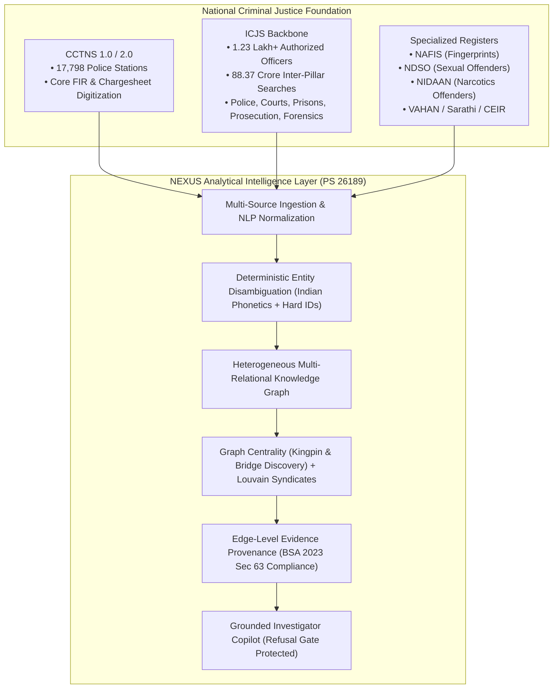

# NEXUS — Project Overview

> **Smart India Hackathon (SIH) 2026**  
> **Problem Statement ID:** 26189  
> **Problem Title:** AI-Powered Criminal Network Analysis System  
> **Organization:** Ministry of Home Affairs (MHA) / National Crime Records Bureau (NCRB)  
> **Department:** Women Safety Division  
> **Category & Theme:** Software / Blockchain & Cybersecurity  

---

## 1. Executive Summary & Value Proposition

**NEXUS** is an **evidence-grounded criminal network intelligence platform** engineered to transform fragmented, multi-source criminal records into an explainable, graph-native investigative decision-support layer for Indian law enforcement.

> **One-Sentence Value Proposition:**  
> *NEXUS bridges disconnected First Information Reports (FIRs), Call Detail Records (CDRs), and financial transaction ledgers into an auditable multi-relational knowledge graph, uncovering hidden kingpins and syndicate structures without black-box predictive bias.*

---

## 2. Institutional Context & Government Ecosystem

NEXUS is designed to operate as a high-order analytical intelligence extension directly above the existing national criminal-justice infrastructure:

- **CCTNS (Crime and Criminal Tracking Network & Systems):** Deployed across **17,798 police stations** nationwide (as of Feb 2026), providing primary crime registration.
- **ICJS (Inter-operable Criminal Justice System):** The national integration backbone connecting police, 3,602 court complexes, 1,370 prisons, 1,000 prosecution offices, and 105 forensic science laboratories (FSLs), with over **88.37 crore cross-pillar searches**.
- **Women Safety Division / NCRB Alignment:** The division overseeing this problem statement administers CCTNS, ICJS, ITSSO, and NDSO. NEXUS aligns with the MHA CCTNS 2.0 roadmap by delivering **explainable, graph-native intelligence** for complex multi-jurisdictional crimes (human trafficking, cyber fraud, extortion, and narcotics syndicates).

---

## 3. Core Capabilities

1. **Multi-Source Ingestion & Entity Disambiguation:** Ingests unstructured FIRs, structured CDRs/IPDR logs, and banking ledgers (IMPS/UPI), resolving suspect aliases and phonetic variations (`Vikram Sharma` ↔ `Bikram Sarma`, `Raju @ Munna` ↔ `Rajesh Kumar`).
2. **Heterogeneous Knowledge Graph:** Models 12 entity types (`Person`, `Case`, `Phone`, `Vehicle`, `Location`, `Organization`, `Device`, `Account`, `Transaction`, `Event`, `IntelligenceReport`, `Evidence`) connected by temporal, weighted relationships.
3. **Syndicate Modularity & Community Detection:** Automatically partitions complex graphs into discrete operational modules using Louvain community clustering.
4. **Kingpin & Broker Isolation:** Employs Betweenness Centrality and PageRank to isolate hidden coordinators who maintain low call volumes but bridge separate criminal cells.
5. **Temporal Sequencing & Recidivism Clusters:** Visualizes chronological communication bursts, fund layering paths, and clusters of suspects sharing burner phones or getaway vehicles.
6. **Evidence Provenance & BSA 2023 Sec 63 Export:** Binds every graph edge to its underlying source record with timestamp, derivation method, and SHA-256 cryptographic verification.
7. **Grounded Investigator Copilot:** Provides natural language query translation backed by an architectural **Ethical Refusal Gate** that rejects autonomous guilt, culpability, or recidivism prediction requests.

---

## 4. Explicit Non-Goals

To maintain institutional trust, legal rigor, and technical feasibility, NEXUS strictly defines what it is **NOT**:

- ❌ **NOT a Predictive Policing Tool:** Does not generate predictive crime forecasts or demographic profiling scores.
- ❌ **NOT an Autonomous Guilt Determination Engine:** Never assigns scores labeled "Guilt", "Probability of Criminality", or "Reoffending Risk". All inferences are strictly topological and evidentiary.
- ❌ **NOT a Replacement for CCTNS / ICJS:** Sits as an analytical decision-support layer above existing transactional systems without requiring transactional database restructuring.
- ❌ **NOT a Black-Box Generative Chatbot:** LLMs are never permitted to assert ungrounded facts or independently forge criminal relationships.
